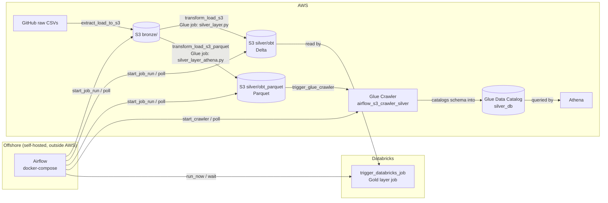

# AWS Pipeline

## Architecture

Airflow runs self-hosted (offshore/outside AWS, via Docker Compose in this repo) and orchestrates the pipeline entirely through AWS API calls (boto3) and the Databricks SDK — it never hosts data itself, only triggers and waits on remote jobs.



- **Bronze**: Airflow downloads CSVs from GitHub and writes them to `s3://airflow-aws-ananda/bronze/{load_date}/`.
- **Silver**: Two Glue jobs read bronze CSVs and join them — one writes Delta (`silver/obt`) for Databricks, the other writes Parquet (`silver/obt_parquet`) for Athena.
- **Catalog**: The Glue Crawler catalogs the Parquet silver data into the `silver_db` database in the Glue Data Catalog, which Athena queries directly (no separate Athena setup needed beyond the catalog).
- **Gold**: A Databricks job (triggered via the Databricks SDK) reads the Delta silver table and produces gold-layer output.

## Setup

Before running this project, create a `.env` file in this directory with the following environment variables:

```
AIRFLOW_UID=50000
aws_access_key_id=<your-aws-access-key-id>
aws_secret_access_key=<your-aws-secret-access-key>
```

`.env` is gitignored and should never be committed.

## Prerequisites for Glue IAM setup

If you want to run AWS Glue from this project, make sure your AWS CLI is configured and you have permission to create IAM roles and attach policies.

### 1. Configure AWS CLI

If you have not configured AWS CLI yet, run:

```bash
aws configure
```

You can also use an existing profile:

```bash
export AWS_PROFILE=<your-profile-name>
```

### 2. Create the Glue role

Run the helper script to create an IAM role named `sparkaccess` and attach the managed policies needed for Glue to work with S3, CloudWatch, and Glue itself:

```bash
chmod +x scripts/manage_glue_role.sh
./scripts/manage_glue_role.sh create
```

### 3. Delete the role when you are done

```bash
./scripts/manage_glue_role.sh destroy
```

### 4. Deploy the Glue job script

Once the `sparkaccess` role exists, upload `scripts/silver_layer.py` to S3 and create (or update) the Glue job to use it, with the `sparkaccess` role attached and Delta Lake enabled:

```bash
aws s3 cp scripts/silver_layer.py s3://airflow-aws-ananda/scripts/silver_layer.py

aws glue create-job \
  --name silver_layer \
  --role sparkaccess \
  --command "Name=glueetl,ScriptLocation=s3://airflow-aws-ananda/scripts/silver_layer.py" \
  --default-arguments '{"--datalake-formats":"delta"}'
```

This step must happen after role creation — the job will fail to be created (or to run) if the `sparkaccess` role does not exist yet. Re-run the `aws s3 cp` command any time `silver_layer.py` changes; use `aws glue update-job` instead of `create-job` if the job already exists.

The job expects a `load_date` parameter (e.g. `2026-06-27`) at runtime, used to read the corresponding `bronze/{load_date}/...` files from S3. This is not set as a job default-argument — it is passed per run via `--load_date` in the `Arguments` of `start_job_run`, as done by `trigger_spark_job` in [utils/silver_layer.py](utils/silver_layer.py).

### 5. Deploy the Athena-compatible silver layer job

`scripts/silver_layer_athena.py` runs the same bookings/airports/passengers join as `silver_layer.py`, but writes the result as **Parquet** (instead of Delta) to `s3://airflow-aws-ananda/silver/obt_parquet`. Athena cannot query Delta tables natively without extra setup (manifests or the Delta/Iceberg connector), so this script produces a plain Parquet table that Athena can query directly, e.g. via a Glue Crawler or `CREATE EXTERNAL TABLE` pointed at `silver/obt_parquet`.

Deploy it the same way as the Delta job, with its own S3 location and Glue job name:

```bash
aws s3 cp scripts/silver_layer_athena.py s3://airflow-aws-ananda/scripts/silver_layer_athena.py

aws glue create-job \
  --name silver_layer_athena \
  --role sparkaccess \
  --command "Name=glueetl,ScriptLocation=s3://airflow-aws-ananda/scripts/silver_layer_athena.py"
```

Note this job does not need `--datalake-formats delta` since it writes Parquet, not Delta. It still requires the `load_date` runtime parameter described above.

### 6. Create the Glue crawler for the silver layer

After `silver_layer_athena.py` has written Parquet data to `s3://airflow-aws-ananda/silver/obt_parquet/`, run a Glue Crawler to catalog it so Athena can query it as a table. The helper script creates the `silver_db` database (if needed) and an `airflow_s3_crawler_silver` crawler pointed at that S3 path, using the `sparkaccess` role:

```bash
chmod +x scripts/manage_glue_crawler.sh
./scripts/manage_glue_crawler.sh create
./scripts/manage_glue_crawler.sh run
```

Re-run `./scripts/manage_glue_crawler.sh run` any time new data lands under `silver/obt_parquet/` to refresh the table schema/partitions in `silver_db`. Delete it with:

```bash
./scripts/manage_glue_crawler.sh destroy
```

## What this script does

The script creates an IAM role for AWS Glue and attaches the permissions Glue needs to run jobs successfully.

### IAM role

An IAM role is an identity that AWS services or users can assume temporarily. In this case, the role is named `sparkaccess` and is intended for AWS Glue.

### Trust policy

The script creates a trust policy that allows your AWS account to assume the role, and also allows the Glue service to assume it:

- Trust policy = who is allowed to use the role
- In this case, your account and Glue are both allowed to assume the role

If you want to restrict this further to a specific IAM user or role, set `TRUST_PRINCIPAL_ARN` before running the script:

```bash
TRUST_PRINCIPAL_ARN="arn:aws:iam::<account-id>:user/your-name" ./scripts/manage_glue_role.sh create
```

### Permission policies

The script attaches managed policies that give the role permissions to:

- run Glue jobs and crawlers: `AWSGlueServiceRole`
- read and write data in S3: `AmazonS3FullAccess`
- write logs to CloudWatch: `CloudWatchLogsFullAccess`
- use Glue console features: `AWSGlueConsoleFullAccess`

### Why this is needed

Glue needs permissions to access your data in S3, create logs, and manage Glue resources. The role centralizes those permissions so Glue can operate without embedding long-lived credentials directly in your workflow.

